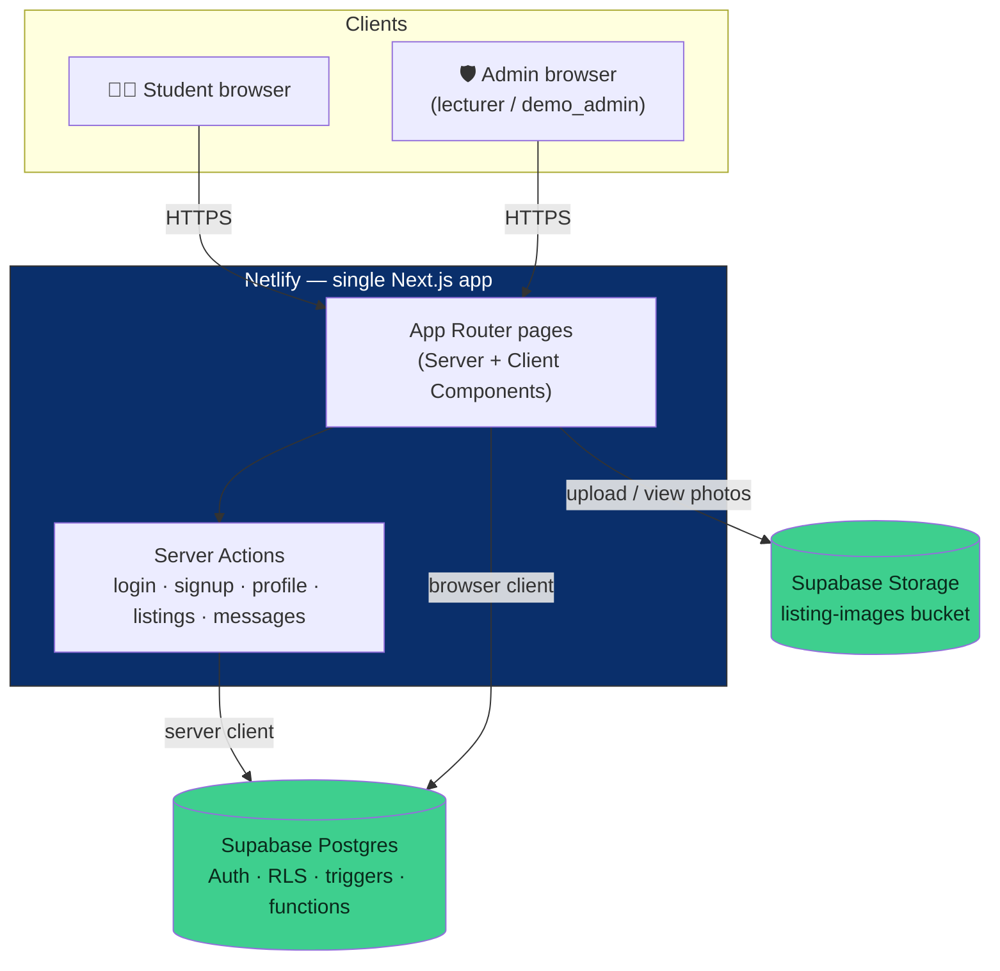
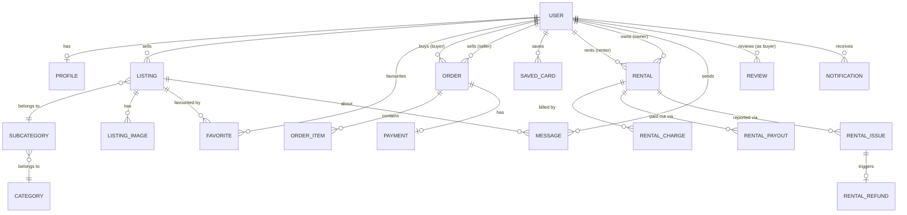
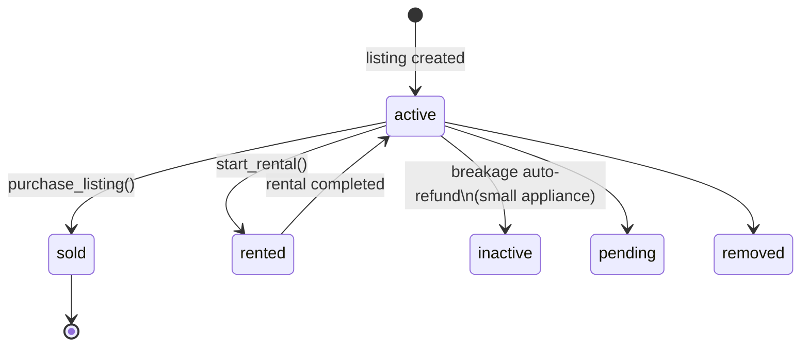
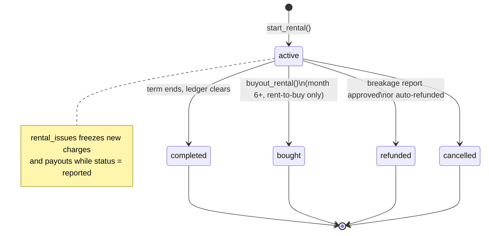

<div align="center">

# Campus Connect

**A shared marketplace and services platform for University of Fort Hare students.**

Buy and sell used goods, rent appliances with a real payment schedule, message a seller, and — soon — book campus laundry and shop the on-campus Student Center. One login, one campus.

[](https://ufhcampusconnect.app)
[](#this-is-a-capstone-project)

[](package.json)
[](package.json)
[](supabase/schema.sql)
[](#tech-stack)
<br/>
[](#team)
[](https://ufhcampusconnect.app)

[Live demo](https://ufhcampusconnect.app) · [Getting started](#getting-started) · [Database schema](supabase/schema.sql) · [Full project documentation](campus-connect-master-documentation.md) · [Repo breakdown](REPO_BREAKDOWN.md)

</div>

---

## This is a capstone project

Payments are **demo only** — saved cards store brand, last 4 digits and expiry, never a real card number, and no money actually moves. Built for a joint **CSC 200 / CSC 300** capstone at the University of Fort Hare, Department of Computer Science, by a 14-person group: **404: Team Name Not Found**.

---

## Contents

[What it does](#what-it-does) · [Architecture](#architecture) · [Data model](#data-model) · [Listing & rental lifecycle](#listing--rental-lifecycle) · [Engineering practices](#engineering-practices) · [Tech stack](#tech-stack) · [Getting started](#getting-started) · [Testing](#testing) · [Project structure](#project-structure) · [Known limitations](#known-limitations) · [Documentation](#documentation) · [Team](#team)

---

## What it does

Two account kinds share one login, each seeing only what their role allows:

| Role | Can do |
|---|---|
| **Student** | Browse/search/filter the fixed-category Marketplace, favourite listings, sell an item (with photos), buy with a demo card or cash-on-collection, rent an eligible appliance on a real payment schedule, buy out a rent-to-buy rental after month 6, report a broken rented appliance, message a seller about a listing, view My Listings / Wishlist / My Rentals, get notified on sales/purchases/rent payments |
| **Admin** (`demo_admin` / lecturer, via `admin_allowlist`) | Everything a student can browse, plus the breakage-report review queue — approve or reject a fridge refund after a repairman's inspection; blocked at the database level from buying, renting or listing anything themselves |

| Module | Status |
|---|---|
| **Marketplace** | Fully built: browse, sell, favourite, buy, rent, rent-to-buy, breakage refunds, seller messaging, notifications, admin review |
| **Laundry Booking** | Scope decided (slot rules, capacity, booking/cancel functions all live in the database — see [`supabase/schema.sql`](supabase/schema.sql)); the student-facing page is still a placeholder |
| **Student Center** | Planned — an on-campus convenience-store module sharing the same database, not yet started |

Every listing, order and rental moves through one real status lifecycle instead of being a one-way write — see [Listing & rental lifecycle](#listing--rental-lifecycle) below.

---

## Architecture

One Next.js app serves the UI and the server logic together; Supabase is the only backend service, reached directly from both the server (Server Actions) and the browser (RLS does the enforcing either way).



No separate backend to deploy: `lib/supabase/server.js` and `lib/supabase/client.js` are the two Supabase clients (server vs. browser — using the wrong one in the wrong context is documented as the most common mistake for new teammates), and every write that touches money or state (`purchase_listing`, `start_rental`, `buyout_rental`, `report_breakage`) is a single Postgres function called through one of them, not a chain of separate inserts from the client.

---

## Data model

Core entities and how they relate (condensed — the live schema has 20+ tables; see [`supabase/schema.sql`](supabase/schema.sql) for every column, constraint and RLS policy).



Every foreign key points back to Supabase's own `auth.users` — the project deliberately never built a separate users/roles table for login itself; `profiles` extends it 1:1, and `user_roles` / `admin_allowlist` layer the student/admin distinction on top.

---

## Listing & rental lifecycle





Both diagrams describe real `check` constraints and `security definer` functions in [`supabase/schema.sql`](supabase/schema.sql), not just an assumed flow — `process_rental_ledger` is what actually advances a rental's charges/payouts as their dates come due.

---

## Engineering practices

Concrete choices, each traceable to a specific file, table or function.

| Practice | Where it shows up |
|---|---|
| **PR-first schema workflow** | Every schema change is committed to GitHub before it's ever run in the Supabase SQL Editor, never applied directly to the live database — a rule adopted after a groupmate's direct SQL Editor edit once dropped and corrupted the `profiles` table |
| **Row Level Security everywhere** | Every table in `supabase/schema.sql` has RLS enabled; `audit_logs` has RLS with zero policies, reachable only from the SQL Editor or a service role |
| **Business rules enforced in the database, not just the form** | `enforce_rent_rules` blocks renting out a non-eligible subcategory or turning on rent-to-buy under R2000, even if a client bypassed the UI entirely |
| **Atomic multi-table writes** | `purchase_listing`, `start_rental` and `buyout_rental` each write every related row (order, order item, payment, ledger entries, listing status) in one Postgres function — no partially-completed purchase or rental is possible |
| **`security definer` functions re-check ownership anyway** | Even though RLS already restricts these tables, every function above re-validates `auth.uid()` and row ownership internally, rather than relying on RLS alone |
| **Demo-only payment data, by design** | `saved_cards` stores brand, last 4 digits and expiry only — never a full card number or CVV, since this is explicitly a demo system, not a real payment integration |
| **Admin capability blocked at the database level** | `c7_admin_restrictions.sql` makes `purchase_listing`, `start_rental` and `buyout_rental` raise an exception for an admin caller directly — not just hidden in the UI |
| **URL-driven navigation state** | The active Marketplace tab, search text and category filter live in the URL (`/market?view=...&cat=...&q=...`), and every link to a listing carries `?from=`, so the Back button returns to the exact tab/filters/scroll position, not always Home (`lib/useScrollRestore.js`) |
| **Honest dead-code tracking** | Superseded components (`Marketplacebrowser.js`, `SiteHeader.js`, `components/icons.js`) are identified and logged for removal rather than silently left in or quietly deleted without explanation |
| **Known gaps documented where the next person will find them** | See [Known limitations](#known-limitations) below — written down, not hidden |

---

## Tech stack

| Layer | Technology | Why |
|---|---|---|
| Frontend + backend | Next.js 14 (App Router, JavaScript) | One codebase for both — no separate backend server, auto-deploys on push to `main` |
| Database + Auth | Supabase (PostgreSQL, Auth, Row Level Security, Storage) | Free tier covers relational data, auth and security rules in one dashboard |
| Hosting | Netlify (Pro plan) | Flat monthly cost for the whole team, versus per-seat pricing elsewhere — the deciding factor for a 14-person group |
| Domain | `ufhcampusconnect.app` via name.com | Free for one year through the GitHub Student Developer Pack; SSL issued automatically by Netlify |
| Styling | Plain CSS, hand-written per page/module | No CSS framework dependency to keep builds light and every teammate's changes easy to reason about |
| Version control | GitHub — `Scanner1hundred/Campus-Connect`, branch `main` | Repo was renamed from `Campus-app` partway through the project |
| Coding environment | GitHub Codespaces (recommended) / local VS Code | Browser-based option for teammates on restricted lab machines |

---

## Getting started

```bash
git clone https://github.com/Scanner1hundred/Campus-Connect.git
cd Campus-Connect
npm install
```

Copy the environment template and fill in your own Supabase project's keys:

```bash
cp .env.local.example .env.local
```

```
NEXT_PUBLIC_SUPABASE_URL=your-supabase-project-url
NEXT_PUBLIC_SUPABASE_ANON_KEY=your-supabase-anon-key
```

**Database:** in the Supabase SQL Editor, run [`supabase/schema.sql`](supabase/schema.sql) once, top to bottom — it's the single merged file, kept in sync with the live database, and already includes every commit through messaging/notifications and the admin restrictions.

```bash
npm run dev
```

Then open `http://localhost:3000`.

---

## Testing

There is no automated test suite yet — the app is verified manually against the 37 seeded demo listings (`is_demo = true`) and by exercising each flow (buy, rent, buy-out, breakage report, admin review) directly in the browser. Adding automated coverage for the payment-schedule and refund functions in `supabase/schema.sql` is a natural next step, since those are the parts with the most room for a silent off-by-one.

---

## Project structure

```
Campus-Connect/
├── app/                       Routes (Next.js App Router)
│   ├── page.js                 Home — UFH-branded landing, Marketplace + Laundry cards
│   ├── layout.js                Root layout; mounts <SessionGuard/>
│   ├── login/, signup/          Auth pages + server actions
│   ├── profile/                 Profile page + server action
│   ├── laundry/                 Placeholder — module scoped, not yet built
│   └── market/
│       ├── page.js                Marketplace shell (tabs driven by ?view=)
│       ├── create/                Sell an item
│       ├── [id]/                  Listing detail (+ edit/)
│       ├── seller/[id]/           Public seller page
│       ├── rentals/               My Rentals (renting + rented-out views)
│       ├── messages/, notifications/  Per-listing chat, notification list
│       └── admin/rentals/         Admin breakage-review queue
├── components/                Reusable UI — Marketplace, checkout/rent modals,
│                                image gallery, card picker, admin queue, etc.
├── lib/
│   ├── supabase/client.js       Supabase client for the browser
│   ├── supabase/server.js       Supabase client for the server
│   └── useScrollRestore.js      URL-keyed scroll position restore
├── public/                    Static assets (crest, campus photo)
├── supabase/
│   ├── schema.sql               All tables, RLS, triggers, functions — kept in
│   │                             sync with the live database
│   └── c6_messaging_notifications.sql, c7_admin_restrictions.sql
│                                 Individually PR'd migrations, merged into
│                                 schema.sql above once confirmed live
├── middleware.js              Route protection
├── jsconfig.json              Enables the "@/" import alias
└── package.json
```

Full file-by-file breakdown for teammates: [`REPO_BREAKDOWN.md`](REPO_BREAKDOWN.md).

---

## Known limitations

Written down here rather than left for someone to discover:

- **RLS gap on `listings.status`** — a seller can currently update their own listing's `status` field directly, including flipping a `rented`/`sold` listing back to `active` outside the app's own state machine. Not yet fixed.
- **No `@ufh.ac.za` domain-lock on signup yet** — deliberately deferred while the Marketplace build was the priority; the mechanism (`admin_allowlist`, `enforce_ufh_email`) exists in the schema but needs enabling.
- **`demo_advance_rental`** is a deliberately-exposed testing shortcut that fast-forwards a rental's clock — must be removed or revoked before any real payment integration.
- **Dead code still in the repo**: `components/Marketplacebrowser.js`, `components/SiteHeader.js` and `components/icons.js` are unreferenced anywhere in the codebase and are candidates for deletion.
- **Laundry Booking and Student Center** are not built out yet — Laundry's rules and database functions exist; its page is a placeholder, and Student Center hasn't started.
- **No automated tests** — see [Testing](#testing) above.

---

## Documentation

| Document | What's in it |
|---|---|
| [`campus-connect-master-documentation.md`](campus-connect-master-documentation.md) | The full project record: architecture, schema, access model, chronological build history, the Marketplace rules/algorithms reference, issues encountered, and outstanding work |
| [`REPO_BREAKDOWN.md`](REPO_BREAKDOWN.md) | Folder-by-folder map written for teammates — "where you probably need to work" |
| [`supabase/schema.sql`](supabase/schema.sql) | Every table, RLS policy, trigger and function, with comments explaining each design choice |

---

## Team

A 14-person group, **404: Team Name Not Found**, University of Fort Hare — built for a joint CSC 200 / CSC 300 capstone spanning Algorithms, Database, Models, Software Documentation, Networks and Security.

---

<div align="center">

Coursework for the Department of Computer Science, University of Fort Hare.
Payments and saved cards in this app are entirely synthetic — no real money moves.

</div>
